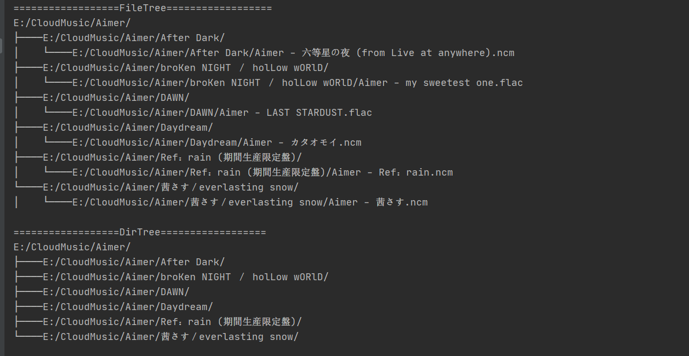

# Export directory or file tree list
**export pretty and readable directory or file tree list.**


```python
from directoryTree import DirectoryTree

if __name__ == '__main__':
    ignore_list = ('.git', '$RECYCLE.BIN', '.svn', 'System Volume Information', '.sync', '.idea')
    tree = DirectoryTree(ignore_list=ignore_list, directory_path=r'E:\CloudMusic\Aimer')
    print('==================FileTree==================')
    print(tree.tree)
    print('==================DirTree==================')
    print(tree.dir_tree)
```





```
==================FileTree==================
E:/CloudMusic/Aimer/
├────E:/CloudMusic/Aimer/After Dark/
│    └────E:/CloudMusic/Aimer/After Dark/Aimer - 六等星の夜 (from Live at anywhere).ncm
├────E:/CloudMusic/Aimer/broKen NIGHT ／ holLow wORlD/
│    └────E:/CloudMusic/Aimer/broKen NIGHT ／ holLow wORlD/Aimer - my sweetest one.flac
├────E:/CloudMusic/Aimer/DAWN/
│    └────E:/CloudMusic/Aimer/DAWN/Aimer - LAST STARDUST.flac
├────E:/CloudMusic/Aimer/Daydream/
│    └────E:/CloudMusic/Aimer/Daydream/Aimer - カタオモイ.ncm
├────E:/CloudMusic/Aimer/Ref：rain (期間生産限定盤)/
│    └────E:/CloudMusic/Aimer/Ref：rain (期間生産限定盤)/Aimer - Ref：rain.ncm
└────E:/CloudMusic/Aimer/茜さす／everlasting snow/
│    └────E:/CloudMusic/Aimer/茜さす／everlasting snow/Aimer - 茜さす.ncm

==================DirTree==================
E:/CloudMusic/Aimer/
├────E:/CloudMusic/Aimer/After Dark/
├────E:/CloudMusic/Aimer/broKen NIGHT ／ holLow wORlD/
├────E:/CloudMusic/Aimer/DAWN/
├────E:/CloudMusic/Aimer/Daydream/
├────E:/CloudMusic/Aimer/Ref：rain (期間生産限定盤)/
└────E:/CloudMusic/Aimer/茜さす／everlasting snow/
```

